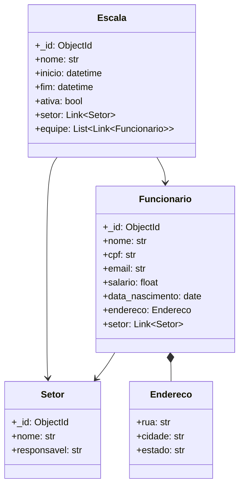

```mermaid
classDiagram
    class Setor {
        +_id: ObjectId
        +nome: str
        +responsavel: str
    }

    class Endereco {
        +rua: str
        +cidade: str
        +estado: str
    }

    class Funcionario {
        +_id: ObjectId
        +nome: str
        +cpf: str
        +email: str
        +salario: float
        +data_nascimento: date
        +endereco: Endereco
        +setor: Link~Setor~
    }

    class Escala {
        +_id: ObjectId
        +nome: str
        +inicio: datetime
        +fim: datetime
        +ativa: bool
        +setor: Link~Setor~
        +equipe: List~Link~Funcionario~~
    }

    Funcionario *-- Endereco
    Funcionario --> Setor
    Escala --> Setor
    Escala --> Funcionario
```